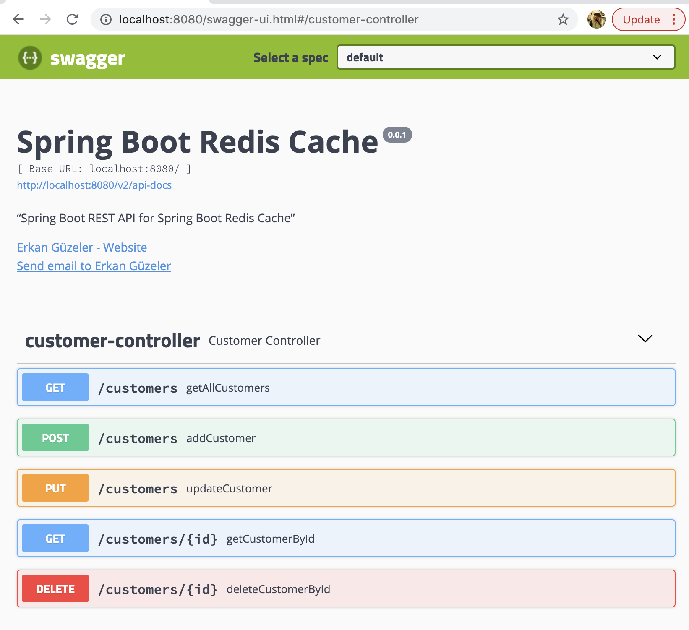

# Spring Boot NCache Cache

Context:

- [Spring Boot NCache Cache](#spring-boot-ncache-cache)
	- [Getting Started](#getting-started)
	- [Maven Dependencies](#maven-dependencies)
	- [NCache Configuration](#ncache-configuration)
	- [Spring Service](#spring-service)
	- [Docker \& Docker Compose](#docker--docker-compose)
	- [Build \& Run Application](#build--run-application)
	- [Endpoints with Swagger](#endpoints-with-swagger)
	- [Demo](#demo)

## Getting Started

In this project, I used NCache for caching with Spring Boot.
When you send any request to get all customers or customer by id, you will wait 3 seconds if NCache has no related data.

## Maven Dependencies

```xml
<dependency>
	<groupId>com.alachisoft</groupId>
	<artifactId>ncache-spring-boot-starter</artifactId>
	<version>5.3.0</version>
</dependency>
```

## NCache Configuration

```java
@Configuration
@EnableCaching
public class NCacheConfig {

	@Bean
	public CacheManager cacheManager() {
		return new com.alachisoft.ncache.spring.cache.NCacheManager();
	}
}
```

## Spring Service

Spring Boot Customer Service Implementation remains the same. The caching annotations like `@Cacheable`, `@CacheEvict`, and `@CacheConfig` work seamlessly with NCache.

```java
@Service
@CacheConfig(cacheNames = "customerCache")
public class CustomerServiceImpl implements CustomerService {

	@Autowired
	private CustomerRepository customerRepository;

	@Cacheable(cacheNames = "customers")
	@Override
	public List<Customer> getAll() {
		waitSomeTime();
		return this.customerRepository.findAll();
	}

	@CacheEvict(cacheNames = "customers", allEntries = true)
	@Override
	public Customer add(Customer customer) {
		return this.customerRepository.save(customer);
	}

	@CacheEvict(cacheNames = "customers", allEntries = true)
	@Override
	public Customer update(Customer customer) {
		Optional<Customer> optCustomer = this.customerRepository.findById(customer.getId());
		if (!optCustomer.isPresent())
			return null;
		Customer repCustomer = optCustomer.get();
		repCustomer.setName(customer.getName());
		repCustomer.setContactName(customer.getContactName());
		repCustomer.setAddress(customer.getAddress());
		repCustomer.setCity(customer.getCity());
		repCustomer.setPostalCode(customer.getPostalCode());
		repCustomer.setCountry(customer.getCountry());
		return this.customerRepository.save(repCustomer);
	}

	@Caching(evict = { @CacheEvict(cacheNames = "customer", key = "#id"),
			@CacheEvict(cacheNames = "customers", allEntries = true) })
	@Override
	public void delete(long id) {
		this.customerRepository.deleteById(id);
	}

	@Cacheable(cacheNames = "customer", key = "#id", unless = "#result == null")
	@Override
	public Customer getCustomerById(long id) {
		waitSomeTime();
		return this.customerRepository.findById(id).orElse(null);
	}

	private void waitSomeTime() {
		System.out.println("Long Wait Begin");
		try {
			Thread.sleep(3000);
		} catch (InterruptedException e) {
			e.printStackTrace();
		}
		System.out.println("Long Wait End");
	}

}
```

## Docker & Docker Compose

Dockerfile:

```
FROM openjdk:8
ADD ./target/spring-boot-ncache-cache-0.0.1-SNAPSHOT.jar /usr/src/spring-boot-ncache-cache-0.0.1-SNAPSHOT.jar
WORKDIR usr/src
ENTRYPOINT ["java","-jar", "spring-boot-ncache-cache-0.0.1-SNAPSHOT.jar"]
```

Docker compose file:

```yml
version: '3'

services:
  db:
    image: "postgres"
    ports:
      - "5432:5432"
    environment:
      POSTGRES_DB: postgres
      POSTGRES_USER: postgres
      POSTGRES_PASSWORD: ekoloji
  cache:
    image: "alachisoft/ncache"
    ports: 
      - "8250:8250"
      - "9800:9800"
    environment:
      - NCACHE_SERVER_LICENSE_KEY=your-license-key
  app:
    build: .
    ports:
      - "8080:8080"
    environment:
      SPRING_DATASOURCE_URL: jdbc:postgresql://db/postgres
      SPRING_DATASOURCE_USERNAME: postgres
      SPRING_DATASOURCE_PASSWORD: ekoloji
      NCACHE_SERVER=cache
    depends_on:
      - db
      - cache
```

## Build & Run Application

* Build Java Jar.

```shell
$ mvn clean install
```

* Docker Compose Build and Run

```shell
$ docker-compose build --no-cache
$ docker-compose up --force-recreate
```

After running the application, you can visit `http://localhost:8080`.

## Endpoints with Swagger

You can see the endpoint in `http://localhost:8080/swagger-ui.html` page.
I used Swagger for visualization endpoints.



## Demo

<div align="center">
  <a href="https://www.youtube.com/watch?v=4yr4JLRK6MM"></a>
</div>

